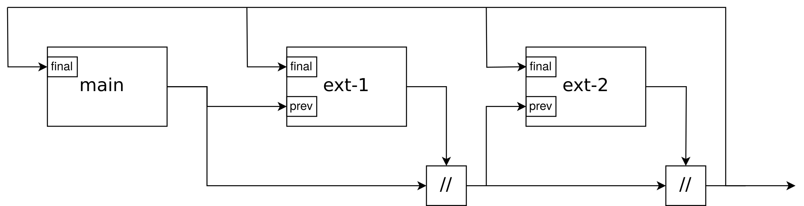

## Миналата лекция

::: nonincremental

- Научихме за `derivation` и `mkDerivation`
- Разработвахме нетривиални пакети

:::

## До къде сме стигнали

- За сега използваме nix само като допълнителна програма към вече съществуваща система

- Nix е пакетен мениджър, та не можем ли да премахнем вградения и да оставим само никс?

- Можем! До това се свежда NixOS

- Обаче ...

# Проблеми и решения на Nix-базирана операционна система

Трябва ни някакво глобално състояние!

- Твърде е неудобно да имаме само един прост шел и за всяко нещо да трябва да викаме `nix-shell`.

- Нужна е по-сложна възпроизводимост между включвания.
  Не може да направим локални състояния, да рестартираме и да ги загубим.

- За хардуер трябва да конфигурираме драйвъри, което рядко може да стане само на ниво shell

- Daemons (сървиси) няма как да се изпълнят само на ниво shell

## Системата като една деривация

- Цялата система е една деривация със специализиран `builder`, съдържащ всички глобални файлове, нужни за системата

- За всяко нещо се правят символични връзки от локации в хард-диска и `/nix/store`

- Изключение праим при bootloader-а, където просто добавяме нова опция

## Получаваме някои интересни ефекти

- Можем да имаме няколко версии на системата, и да избираме при включване коя искаме

- Лесно можем да разпространяваме конфигурацията

- Лесно можем да направим виртуална машина за дадена система

## И някои важни проблеми

- Една система ще има **много** nix код в себе си, твърде много да очакваме потребителя сам да го поддържа

- Трудно е да включваме/излключваме/презаписваме стойности, голямото количество код прави промените сложни

# Модули

- Всички тези проблеми са решени чрез модулната система на nixpkgs

- Това е библиотека, т.е. всичко е имплементирано чрез Nix

- С един модул дефинираме конфигурационни опции и нещата които се случват когато дадем стойност на опция

---

- Модул е функция, приемаща атрибутно множество и връщаща атрибутно множество

- Върнатото има 3 задължителни атрибута

  - `imports`, списък с пътища към други модули
  - `options`, възможните опции; имена и типове на аргументите
  - `config`, конкретните стойности на чужди опции, спрямо или не избраните опции за тукашния модул

## Опции

- Модулната система е **библиотека** и Nix е динамично типизиран

- Опциите са атрибутни множества сами по себе си, с някакви очаквани атрибути

- Функции в библиотеката *експлицитно* правят проверки между опциите, които сме декларирали и стойностите, които са дадени

## Деклариране на опции

- Опции се декларират чрез атрибутно множество, което се подава на `lib.mkOption`

- Главните атрибути са `type` и `description`, името се определя в модула

- Някои от по-често използваните типове са: `bool`, `int`, `str`, `package` (деривация), `listOf TYPE`

  ```nix
  someOption = lib.mkOption {
      type = lib.types.int;
      default = 100;
      example = 300;
      description = "Hello World";
  };
  ```

---

- Имаме "вградени" модули

- Почти винаги конкретните стойности са върху опции от вградените модули или модули, надграждащи ги

- Фундаментално всичко се свежда до дервации.

  `systemd` сървиси се създават чрез `runCommand`: <https://github.com/NixOS/nixpkgs/blob/master/nixos/lib/systemd-lib.nix#L66-L91>

## Примери

<!-- TODO -->

# Входни опции и конфигурации

- Входното атрибутно множество на един модул е съставено от:

  - `pkgs`, всички пакети в системата (nixpkgs)
  - `lib`, което е същото като `pkgs.lib`
  - `options`, всички дефинирани опции във всички модули
  - `config`, финалните конфигурационни опции в системата (като няма бездънни рекурсии)

---

- Как изобщо е възможно да се попълни стойността на `config`?

- Една подсказка, е че то не може да прави безкрайна рекурсия върху примитивни данни (може върху композитни), т.е. при това ще получим грешка:

  ```nix
  { config, ... }: {
      config.x = config.x + 1;
  }
  ```

## fix функцията

- `fix` "намира" неподвижни точки, тоест връща стойност която е същата като входа

- Идва от факта, че Nix е функционален и **lazy evaluated**

- Атрибутни списъци, списъци и функции могат да бъдат лениво оценени, тоест

  - при индексиране в атрибутно множество или обикновен списък, можем да достъпим съответния елемент **без** да заредим останалите елементи в паметта

  - функции няма да се изпълнят, ако накрая не използваме техния резултат

- Детайлите на какво се случва ще разгледаме в края на курса

- По-повърхностно, можем да си го представим като обобщение на `rec`

## Примери

<!-- TODO -->

# Нека да си направим NixOS машина

## Конфигурацията на една машина

- Започваме с два модула: `configuration.nix` и `hardware-configuration.nix`

- Първия е началната точка на нашата конфигурация

- Втория се употребява за хардуерни подробности

<!-- TODO: как да направим minimal configuration, без flake-ове, и как да пуснем виртуална машина от него -->

## Промяна на pkgs

- Появява се нужда от лични пакети (деривации), които нямат място в публичния nixpkgs

- Може да се нуждаем от специфични промени по пакети, примерно да добавяме patch-ове или да компилираме съществуващи пакети с други флагове

- Това се разрешава от `overlay` "библиотеката" в nixpkgs

## Overlay

- Един overlay е функция, която:

  - приема два аргумента - `final`, което е nixpkgs с този overlay поставен и `prev`, което е nixpkgs без него
  - връща атрибутно множество, с което nixpkgs ще се обнови

- Логиката се свежда до `pkgs = pkgs // (my_overlay final prev)`

---



---

### Примери

```nix
final: prev: {
   google-chrome = prev.google-chrome.override {
     commandLineArgs =
       "--proxy-server='https=127.0.0.1:3128;http=127.0.0.1:3128'";
   };
};
```

<!-- TODO -->
